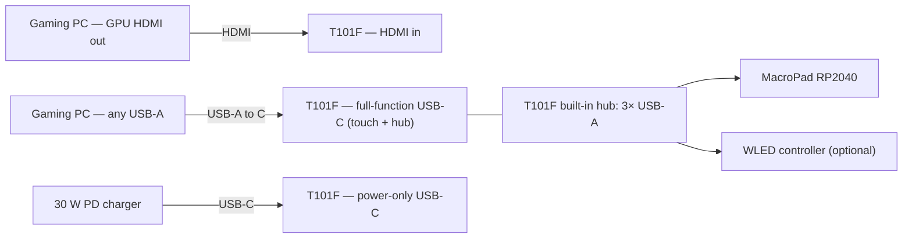
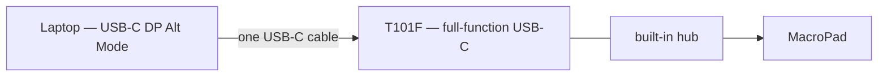
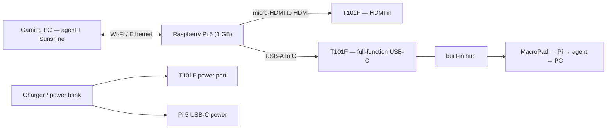
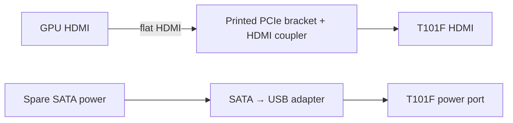

# PC Stats Display + Desk Dock — Build Plan (rev 2, 2026-09-06)

A 10.1" **wide** touchscreen (Magedok T101F, 1540×720, 2.14:1) that is a real second monitor
(HDMI / USB-C, zero drivers), living in a 3D-printed desk dock with a 12-key macro pad and knob.
It shows CPU/GPU/RAM/temps at home, snaps into the PC case for the show-off build, travels to
the office as a one-cable second screen, and can go **wireless** with a Raspberry Pi 5 hidden in
the dock base.

Rev 2 changes: the T101F replaces the 16:10 T101E. Because the T101F has its own 3-port USB hub,
the dock no longer needs a USB-C hub, an HDMI switch or a rear HDMI coupler. Budget drops from
≈$381 to ≈$270 for the dock tier, and a wireless module is added as an option.

Prices checked 2026-09-06 (US). **Verified** = read from the vendor page. **est.** = typical
street price, confirm at checkout.

---

## 1. The verdict

**Panel:** Magedok T101F. 10.1" 1540×720 IPS, 350 nits, 10-point touch, one full-function USB-C
(video + touch + power), one power-only USB-C, one HDMI, **three USB-A ports that act as a hub for
whatever is plugged into the USB-C**, 2×1 W speakers, VESA 75×75, fold-out stand, 249×131.6×20 mm,
460 g, ~5 W. $99 at Magedok (list $129). Same monitor on Amazon as B0FGCVT6P2 (4.2★, 128 ratings)
and on Newegg. **Magedok's own store shows it sold out with no restock date**, so buy from Amazon or
Newegg, or wait.

Why the wide format works for this project:
- Only 132 mm tall, so it stands on a PSU shroud without covering the graphics card. The 16:10
  10.1" was 165 mm and reached into the card.
- 249 mm wide, which is a natural "sensor panel" shape: gauges left, touch grid right, or a full-width strip.
- The built-in USB hub means the macro pad plugs into the *monitor*. One cable from a laptop carries
  video, touch, power and the macro pad. That is the whole dock, electrically.

Rejected on the way here: Raspberry Pi as the display (a Pi cannot be a monitor), Elgato Stream
Deck (needs host software, useless on a locked office PC), Waveshare "USB Monitor" bars (not real
monitors), and 15.6" bargains (no touch, do not fit a case).

---

## 2. Three modes plus wireless

| Mode | Video | Touch + macro pad | Power | Cables to the computer |
|---|---|---|---|---|
| Desk, wired | GPU HDMI → monitor HDMI (or motherboard USB-C with DP Alt Mode → monitor USB-C) | PC USB-A → monitor full-function USB-C (USB-A→C cable). Macro pad in a monitor USB-A port | 30 W PD charger → power-only USB-C | 2 (HDMI + USB), or 1 with DP Alt Mode |
| Office | Laptop USB-C → monitor full-function USB-C | Same cable | Same cable (laptop powers it) | 1 |
| Case | GPU HDMI through a printed PCIe slot pass-through | Not needed | SATA rail → adapter (see §7) | 0 external |
| **Wireless** (optional) | Pi 5 in the dock base → monitor HDMI | Pi USB-A → monitor USB-C; macro pad on the monitor hub reaches the Pi | Charger → monitor, PSU → Pi (or one 20 000 mAh PD power bank for both) | 0 to the PC. Wi-Fi does the rest |

---

## 3. Wiring

### Desk, wired (gaming PC with a discrete GPU)



### Office (laptop with USB-C DisplayPort Alt Mode)


Laptop without USB-C video: its HDMI → monitor HDMI, its USB-A → monitor USB-C. Same as home.

### Wireless (Pi 5 hidden in the dock)



### Case


Wireless alternative inside the case: mount the Pi 5 in the case too, powered from SATA. Then no
video cable leaves the case at all.

---

## 4. Wireless: the honest version

"Wireless display" removes the cable to the PC. It does not remove power. The monitor draws ~5 W,
the Pi 5 another 3–6 W. On a desk that is one charger cable; for a truly cordless panel a 20 000 mAh
USB-C PD power bank runs monitor + Pi for roughly 5 hours, monitor alone for 10+.

Three ways to do it, in order of how much I recommend them:

### 4a. Raspberry Pi 5 as a thin client (recommended)

The dashboard is a web page served by the agent on your PC. A Pi 5 (1 GB is plenty) in the dock
base runs a full-screen browser pointed at it over Wi-Fi. Touch goes to the Pi, the page posts the
action to the agent, the agent presses the key or switches the desktop. Latency is unnoticeable
for gauges and buttons. Works from anywhere on your home network, and the same Pi can move into
the case.

- Pi 5 1 GB: $45 list, $42.99 at Micro Center. Price-protected, in stock at the usual resellers
  (CanaKit, PiShop, Adafruit, Micro Center). Do not buy a Zero 2 W: $15 list but unobtainable at
  list in 2026.
- Software: Raspberry Pi OS, Chromium in `--kiosk` at 1540×720, auto-login, a systemd unit that
  waits for the agent to answer and then launches. Touch works out of the box (the T101F is a
  standard HID touchscreen). A 40-line Python service grabs the MacroPad's key events
  (`evdev`) and forwards them to the agent, so the keys keep working wirelessly.
- Office: corporate Wi-Fi usually isolates devices, so at work you plug the laptop's USB-C into
  the monitor as before and the Pi sits idle. Nothing to configure.

### 4b. Real wireless second monitor: Sunshine + Moonlight on the same Pi

If you want Windows to *see* the panel as a monitor while it is wireless: install
[Sunshine](https://github.com/LizardByte/Sunshine) (free) on the PC and the
[Virtual Display Driver](https://github.com/VirtualDrivers/Virtual-Display-Driver) (free) to
create a 1540×720 virtual monitor. Moonlight-Qt on the Pi streams that monitor at 720p60 with
20–40 ms latency on 5 GHz Wi-Fi, less on Ethernet. Drag any window to it, run AIDA64's
SensorPanel on it, whatever you like. Touch arrives as mouse clicks. This coexists with 4a: the Pi
boots into the dashboard and you switch to Moonlight when you want the whole monitor.

### 4c. Miracast dongle ($20–30, quick and dirty)

An EZCast / AnyCast style receiver in the monitor's HDMI port, powered from a monitor USB-A port.
Windows: Win+K → Extend. No software, but 100–200 ms lag, occasional dropouts, and **no touch**
(the touch data has no path back to the PC). Fine for gauges only.

---

## 5. Bill of materials

### Module A — Display

| Item | Spec | Price | Status | Where |
|---|---|---|---|---|
| **Magedok T101F** | 10.1" 1540×720 IPS, 350 nits, 10-pt touch, USB-C full-function + USB-C power-only + HDMI + 3× USB-A hub + 3.5 mm, 2×1 W speakers, VESA 75×75, 249×131.6×20 mm, 460 g, ~5 W. Box: USB-C 3.1 Gen 2 cable, USB-C→USB-A cable, HDMI cable, mounting screws, 12 V power adapter (per accessory list; FAQ also mentions a 30 W PD adapter) | **$99** (list $129) | Verified. **Sold out at Magedok**, no restock date | [store.magedok.com](https://store.magedok.com/products/10-1-inch-ips-1540-720-usb-c-portable-touchscreen-mini-monitor-t101f) · [Amazon B0FGCVT6P2](https://www.amazon.com/dp/B0FGCVT6P2) · [Newegg](https://www.newegg.com/p/3C6-020A-014Z2) |

Power note: the store lists a 12 V adapter and typical 5 W draw. Until the unit is in hand, assume
the power-only port wants USB-PD (any 20–30 W PD charger negotiates 9/12/15 V). If it happily runs
on 5 V, the in-case power gets simpler (§7).

Fallbacks if the T101F stays out of stock: Magedok T101E 16:10 ($139, in stock), Waveshare
8HP-CAPLCD 8" ($69.99, in stock), Magedok T089B 8.9" ($89, also out of stock). Full comparison of
touch panels under $100 is in §11.

### Module B — Control surface

| Item | Price | Status | Where |
|---|---|---|---|
| Adafruit MacroPad RP2040 bare board #5100 | $34.95 | 21 in stock | [adafruit.com/product/5100](https://www.adafruit.com/product/5100) |
| Enclosure + hardware add-on pack #5103 | $4.95 | in stock | tick the add box on the #5100 page |
| Kailh Linear Black switches 12-pack #5876 (Red #5122 is out) | $7.95 | in stock | same page |
| Clear DSA keycaps 12-pack #5068 | $6.95 | in stock | same page |
| — or Starter Kit #5128 (all of the above, red switches) | $49.95 | out of stock | [adafruit.com/product/5128](https://www.adafruit.com/product/5128) |

Bare-board route total **$54.80**. The MacroPad plugs into one of the monitor's USB-A ports.

### Module C — Dock electronics (much shorter now)

| Item | Role | Price | Status | Where |
|---|---|---|---|---|
| Anker Nano 30 W USB-C PD charger (B0B2MLRF93) | Powers the monitor at home. Replaces the 65 W two-port charger | $16 list, often $10–12 | Verified | [Amazon](https://www.amazon.com/dp/B0B2MLRF93) |
| Cable Matters USB-C Gen 2 100 W 4K cable, 1 m (B01L0F6AJI) | Laptop → monitor at the office | $10 | est. | [Amazon](https://www.amazon.com/dp/B01L0F6AJI) |
| Cable Matters USB-A→C 1 ft 2-pack (B018X3IM6Y) | Monitor hub → MacroPad, PC → monitor | $10 | est. | [Amazon](https://www.amazon.com/dp/B018X3IM6Y) |
| UVOOI HDMI 1 ft 2-pack (B0B5JM7Y4G) | Pi → monitor inside the dock | $7 | est. | [Amazon](https://www.amazon.com/dp/B0B5JM7Y4G) |
| 24-pin magnetic USB-C adapter (B09YRGSZ6G), optional | Breakaway tip at the laptop | $18 | est. | [Amazon](https://www.amazon.com/dp/B09YRGSZ6G) |
| WLED ESP32 controller (B0FC2VPXHX) + 1 m WS2812B 5 V strip (B01CDTED80), optional | Underglow tied to GPU temp | $32 | Verified range | Amazon |

Gone from rev 1: Anker 7-in-1 hub, Fosmon HDMI switch, HDMI keystone couplers, 65 W charger. Saves about $75.

### Module D — Dock body and mounting

| Item | Price | Status | Where |
|---|---|---|---|
| Filament PETG/ASA 1 kg (or JLC3DP service $20–45) | $25 | est. | Amazon / [jlc3dp.com](https://jlc3dp.com) |
| N52 discs 10×3 mm, 50-pack (B0C4NGVZGG) | $9 | est. | Amazon |
| M3 heat-set inserts 100 (B0BVMMBG2N) | $9 | est. | Amazon |
| M2/M3/M4 socket screw kit (B0CHMKL1DF) | $6 | est. | Amazon |
| Rubber feet (B085DMB1XV) | $5 | est. | Amazon |
| Quick-release VESA bracket, free STL to remix | $0 | — | [printables.com/model/426037](https://www.printables.com/model/426037-quick-release-bracket-for-vesa-monitors) |

Dock design targets for the T101F: base ≈ 280 × 120 × 40 mm, screen at 20°, MacroPad recessed
in front at 10°, a bay in the base for the Pi 5 (85 × 56 mm, with its active cooler, vent slots)
and the charger, magnets + ledge on a VESA-75 carrier plate.

### Module E — Wireless kit (optional)

| Item | Price | Status | Where |
|---|---|---|---|
| Raspberry Pi 5, 1 GB | $45 list / $42.99 Micro Center | Verified | [CanaKit](https://www.canakit.com/raspberry-pi-5-1gb.html) · Micro Center · PiShop |
| Official 27 W USB-C PSU | ~$12 | est. | same |
| Active cooler or case with fan | ~$10 | est. | same |
| micro-HDMI → HDMI cable, 0.3–0.5 m | ~$7 | est. | Amazon |
| microSD 32 GB A1 | ~$8 | est. | Amazon |
| — or a Miracast receiver (EZCast / AnyCast) | $20–30 | Verified range | Amazon |
| — for cordless use: 20 000 mAh USB-C PD power bank | ~$40 | est. | Amazon |

Wireless kit ≈ **$82** with the Pi.

### Module F — In-case kit

| Item | Price | Where |
|---|---|---|
| SATA 15-pin → USB-A female 5 V adapter (if the panel accepts 5 V) | $8–12 | [eBay CRJ](https://www.ebay.com/itm/127511365504) |
| — or SATA → 12 V 5.5×2.5 barrel cable + 12 V barrel → USB-C PD trigger cable (if it insists on 12 V) | ~$15 | Amazon |
| Flat HDMI 5 ft (B074SXRP6G) + right-angle HDMI (B00CF4G7JC) | $18 | Amazon |
| Printed PCIe HDMI pass-through bracket + one HDMI keystone coupler | $0 + $8 | [printables.com/model/346692](https://www.printables.com/model/346692-pcie-bracket-with-screw-in-hdmi-slot-for-sensor-pa) · Monoprice |
| DP → HDMI adapter (B00K0UDYLM), only if the GPU's HDMI is taken | $9 | Amazon |

### Module G — Software (all free unless noted)

LibreHardwareMonitor (sensors, `/data.json` on :8085) · your agent + dashboard · PSVirtualDesktop ·
CircuitPython + `adafruit_macropad` · Raspberry Pi OS + Chromium kiosk · Sunshine + Virtual
Display Driver + Moonlight-Qt (wireless monitor mode) · AIDA64 Extreme (~$65.95) only if you'd
rather not build gauges.

---

## 6. Budget tiers

| Tier | Contents | Total |
|---|---|---|
| 1 — Panel only | T101F with its own cables and adapter, agent + dashboard in a kiosk window. Works on the desk and at the office today | **$99** |
| 2 — Dock | Tier 1 + MacroPad $54.80 + 30 W charger $16 + cables $27 + magnetic tip $18 + magnets/inserts/screws/feet $29 + filament $25 | **≈ $269** |
| 3 — Wireless dock | Tier 2 + Pi 5 kit $82 | **≈ $351** |
| 4 — Show-off | Tier 3 + WLED $32 + in-case kit $35 + power bank $40 | **≈ $458** |

---

## 7. Software plan

Unchanged from rev 1 for the PC side (agent polls LibreHardwareMonitor at 500 ms, serves the
dashboard on :4400 with a WebSocket, `POST /action/<id>` runs macros, Edge kiosk pinned to the
1540×720 display by size, Tablet PC Settings → Setup to map touch). Layouts change to fit
1540×720: a left 60 % gauge strip and a right 3×4 touch grid, or a full-width strip for the case.

New for the Pi:

```
software/pi/
  install.sh          Pi OS Lite + Wayland kiosk (cage or labwc) + Chromium
  kiosk.service       waits for http://gaming-pc:4400/health, launches chromium --kiosk
  macropad-forward.py evdev: grabs the MacroPad, maps F13–F24 to POST /action/<id>
  moonlight.md        Sunshine + Virtual Display Driver on the PC, Moonlight-Qt pairing on the Pi
```

Pi kiosk launch line:
```
chromium --kiosk --noerrdialogs --disable-infobars --ozone-platform=wayland \
  --window-size=1540,720 "http://gaming-pc.local:4400/?layout=desk"
```

Windows virtual monitor for Moonlight mode: install the Virtual Display Driver, set one virtual
monitor to 1540×720 @ 60 in its settings file, then in Sunshine add an app whose "output" is that
display. Moonlight on the Pi pairs once with a PIN and then auto-connects.

---

## 8. Build sequence

| Weekend | Do | Done when |
|---|---|---|
| 0 | Pre-purchase checks (§9). Order T101F (Amazon/Newegg while Magedok is out) + MacroPad parts. | Shipped |
| 1 | HDMI + USB-A into the PC. Extend, Tablet PC Setup. LibreHardwareMonitor + agent + desk layout at 1540×720. Kiosk task. Confirm the monitor's USB-A ports pass a keyboard through to the PC. Note what voltage the power port accepts. | Gauges at logon, MacroPad works through the monitor's hub |
| 2 | Flash CircuitPython, layers, test on the office laptop with one USB-C cable. | Desktop switching from keys + touch on both machines |
| 3 | Measure. CAD the dock: 280×120 base, Pi bay, charger bay, VESA-75 carrier + magnets. Print carrier + receiver first. | Snaps on and off |
| 4 | Print the body, fit MacroPad and charger, cable it. PCIe pass-through and case receiver. | One-cable office test, case test |
| 5 | Pi 5: kiosk image, macropad forwarder, Sunshine + Moonlight. Underglow. | Panel runs with no cable to the PC |

---

## 9. Pre-purchase checks

1. Office laptop: USB-C with video (⚡ or DP logo)? Otherwise HDMI + USB-A works too.
2. IT policy: external displays and USB keyboards allowed? (USB storage often blocked → boot.py hides the MacroPad drive.)
3. Gaming PC: free GPU HDMI? Else DP→HDMI adapter. Motherboard USB-C with DP Alt Mode? Then one cable at home.
4. Case: flat spot ≥ 260 × 140 mm with 25 mm clearance (the T101F is 20 mm thick). Free PCIe slot cover, spare SATA connector.
5. Wi-Fi: 5 GHz reachable at the desk for the wireless mode; Ethernet to the dock is even better.
6. Printer access: own, makerspace, or JLC3DP.

---

## 10. Gotchas

- **Stock.** Magedok's store is sold out. Amazon and Newegg carry the same SKU; check price before buying, it drifts between $99 and $129.
- **Power port voltage** is unconfirmed. Keep the included adapter as the dock brick if the Anker 30 W does not light it up, and pick the in-case power adapter after testing 5 V.
- **The monitor's hub only works when its USB-C is connected to a host.** In HDMI-only mode with nothing on the USB-C, the USB-A ports are dead. Always run the USB-A→C cable to the PC (or the Pi).
- **Miracast has no touch path.** Only the Pi routes give you touch wirelessly.
- **Two HDMI sources** (GPU and Pi) share one HDMI input. Choose per session, or add the $15 HDMI switch back if you want both cabled at once.
- Touch on the wrong screen after re-plugging → Tablet PC Settings → Setup.
- LibreHardwareMonitor needs admin and binds all interfaces → Task Scheduler + firewall rule.
- Magnets don't carry weight in shear; the carrier plate needs a ledge.

---

## 11. Touch panels under $100 (checked 2026-09-06)

| Panel | Size / res | USB-C video | HDMI | Mount | Price | Notes |
|---|---|---|---|---|---|---|
| **Magedok T101F (chosen)** | 10.1" wide 1540×720, 10-pt, 350 nits | Yes + power-only USB-C + 3-port hub | Yes | VESA 75 | $99 | Out of stock at Magedok; Amazon B0FGCVT6P2, Newegg |
| Waveshare 8HP-CAPLCD Monitor | 8" 1280×800, 10-pt | Yes | Yes | VESA 50 | $67.27–69.99 official | Aluminum case, cables + stand in the box |
| Waveshare 7EP-CAPLCD Monitor | 7" 1280×800, 10-pt | Yes | Yes | VESA 50 | $77.27–79.99 | Smaller, pricier |
| LESOWN P89GPT | 8.9" 1920×1200, 5-pt, 350 nits | Listed, unverified | mini | VESA | $52.99 Walmart / $125 lesown.com | Price gap is suspicious |
| Magedok T089B | 8.9" 1920×1200, 10-pt, 450 nits | Yes + power-only | Yes | VESA | $89 | Out of stock |
| Elecrow 8" | 8" 1280×800 | No | mini | VESA | $56.90 | HDMI only |
| LESOWN P88-T | 8.8" 1920×480 bar | Yes | — | — | $94.47 | Touch bar |

---

## Sources checked 2026-09-06

Magedok store pages and products.json · Amazon/Newegg T101F listings (titles and rating counts;
prices not fetched) · Adafruit #5100/#5103/#5876/#5068/#5128 · Waveshare 8HP/7EP/10.1HP pages
via search, PiShop, Welectron · LESOWN store products.json and Walmart listings · Raspberry Pi
pricing news and reseller pages · Anker charger listings · Sunshine / Virtual Display Driver /
Moonlight repositories · Miracast adapter roundups · LibreHardwareMonitor and PSVirtualDesktop docs.
